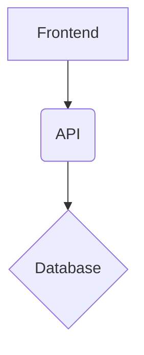

# Proyecto Backend - Boost Music

Este es el backend para el proyecto Boost Music, una tienda de música en línea. Funciona en conjunto con el repositorio frontend que se puede encontrar en [https://github.com/Shadowmataj/boost_music_frontend](https://github.com/Shadowmataj/boost_music_frontend).

## Descripción

El backend de Boost Music está diseñado para manejar todas las operaciones de una tienda de comercio electrónico de música. Las características principales incluyen:

*   **Gestión de usuarios:** Registro, inicio y cierre de sesión de usuarios.
*   **Gestión de inventario:** Permite la administración de productos, incluyendo la creación, actualización y eliminación de artículos del catálogo.
*   **Control de stock:** Realiza validaciones en tiempo real para asegurar la disponibilidad de los productos antes de procesar una compra.
*   **Carrito de compras:** Funcionalidad completa para que los usuarios puedan agregar, modificar y eliminar productos de su carrito.
*   **Procesamiento de pedidos:** Lógica para la creación y seguimiento de los pedidos realizados por los clientes.

## Diagrama de Arquitectura

## Estructura del Proyecto

*   `Dockerfile`
*   `README.md`
*   `package-lock.json`
*   `package.json`
*   `src/`
    *   `app.js`
    *   `config.js`
    *   `artillery/`
    *   `auth/`
    *   `controller/`
    *   `dao/`
    *   `faker/`
    *   `models/`
    *   `routes/`
    *   `services/`
    *   `views/`
    *   `winston/`
    *   `docs/`
    *   `public/`
*   `test/`

## Dependencias

* @faker-js/faker: ^9.0.1
* bcrypt: ^5.1.1
* class-validator: ^0.14.1
* commander: ^12.1.0
* connect-mongo: ^5.1.0
* cors: ^2.8.5
* dotenv: ^16.4.5
* express: ^4.19.2
* express-handlebars: ^8.0.1
* express-session: ^1.18.0
* jsonwebtoken: ^9.0.2
* moment: ^2.30.1
* mongoose: ^8.3.4
* mongoose-paginate-v2: ^1.8.1
* multer: ^1.4.5-lts.1
* nodemailer: ^6.9.14
* nodemon: ^3.1.4
* passport: ^0.7.0
* passport-github2: ^0.1.12
* passport-google-oauth20: ^2.0.0
* passport-local: ^1.0.0
* session-file-store: ^1.5.0
* socket.io: ^4.7.5
* swagger-jsdoc: ^6.2.8
* swagger-ui-express: ^5.0.1
* toastify-js: ^1.12.0
* twilio: ^5.2.2
* winston: ^3.13.1

## Dependencias de Desarrollo

* artillery: ^2.0.20
* chai: ^5.1.1
* mocha: ^11.1.0
* supertest: ^7.0.0
